# Lab 0: Getting started with Logisim-Evolution

## 1. Introduction

In this lab, you will learn how to use Logisim-Evolution and built an 8-bit full adder.
This lab will not be graded.

### Setup

First, you should download [Logisim-Evolution version 3.8.0](https://github.com/logisim-evolution/logisim-evolution/releases/download/v3.8.0/logisim-evolution-3.8.0-all.jar).
Once downloaded, copy the file into your home directory.

Then, open up a terminal (on Windows, use WIN+R, and then type `cmd`) and then navigate to your home directory where you have copied the simulator jar file (on Windows, type `M:\` in the terminal and then use `cd` to navitage to the right place).
You can then launch the simulator from the command line by typing : `java -jar logisim-evolution-3.8.0-all.jar`
You will need to have a recent version of JavaSE which can be obtained from this link [JavaSE](https://www.oracle.com/ca-en/java/technologies/downloads/)

## 2. Building a 1-bit Full Adder Circuit
Logisim is a simple tool to use, most of the features you will need are well documented in the reference document. You can obtain the guide from the [Logisim Documentation page](http://www.cburch.com/logisim/docs/2.7/en/html/libs/index.html).


All Logisim is divided into three parts, called the explorer pane, the attribute table, and the canvas. Above these parts are the menu bar and the toolbar.
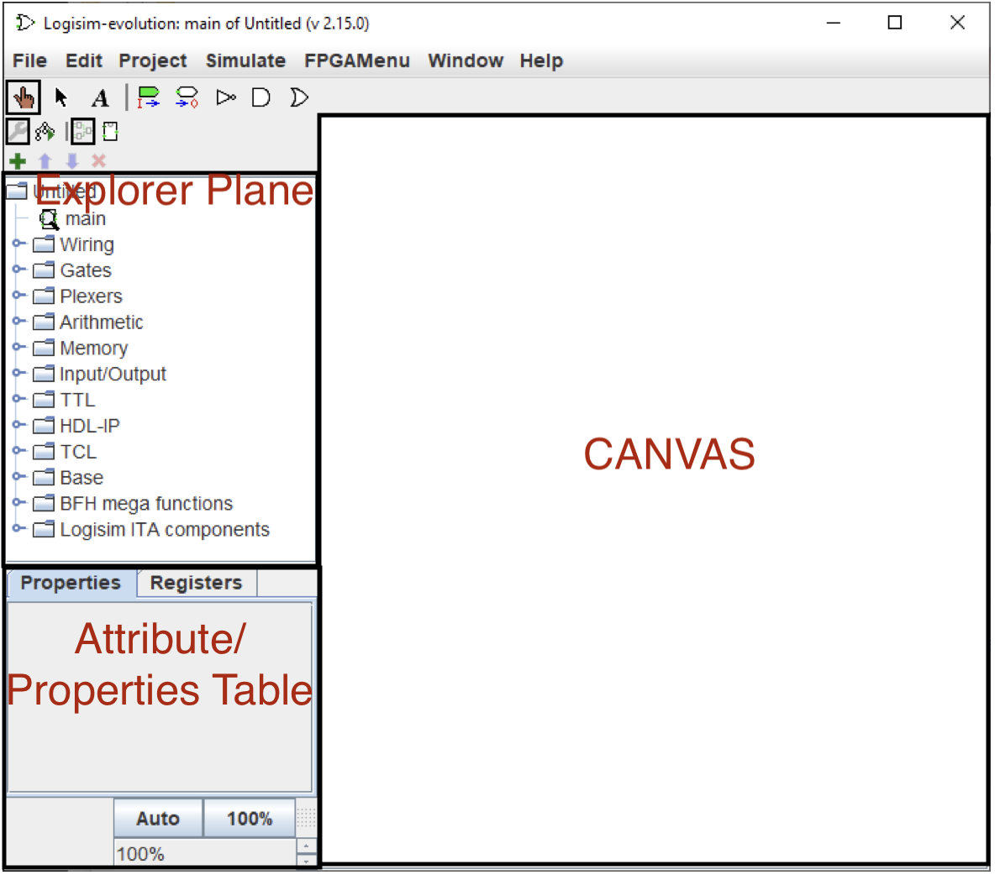

Logisim-Evolution permits designers to work with a main circuit and any number of subcircuits. Students who have studied programming languages are familiar with “functions” or “classes” that can be designed and built one time and then reused many times whenever they are needed. Logisim Evolution permits that same type of modular design by using subcircuits. In this part, you will design a one-bit full adder subcircuit using basic AND/OR/XOR/NOR/NAND gates.

Recall that the equation for a one-bit full adder is: 

- Sum=(A XOR B) XOR Cin


- Cout= (A AND B) OR (Cin AND (A XOR B)) 
  
To implement this circuit in Logisim:


1. First Create a subcircuit using the Add circuit plus button on top of the explorer plane. 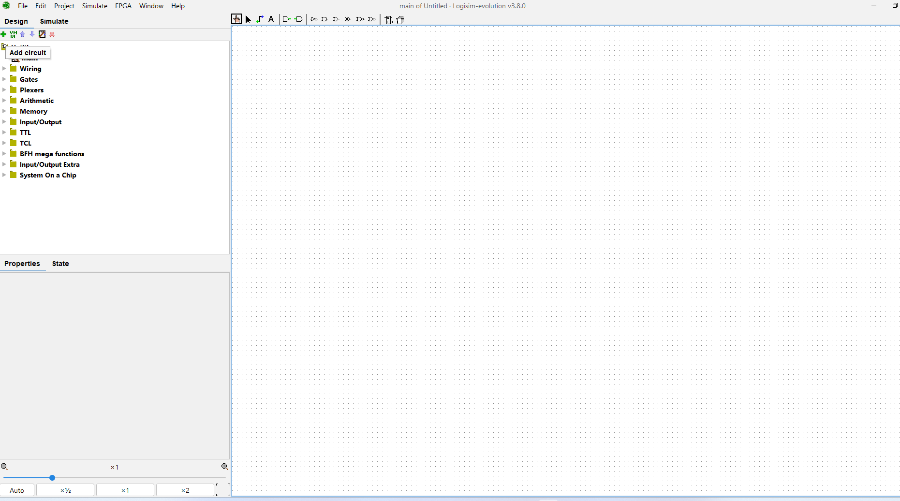
   
2. You will be prompted to name this circuit. 
   
   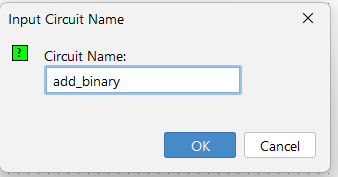


3. There are only three variables used in the entire expression: A, B, and Cin. Therefore, there would be three input pins into the circuit. The circuit would output two bits of output Sum and Cout. Therefore, two output pins must be specified. Start by placing the three inputs and two outputs on the drawing canvas. Inputs are indicated by a green icon with I-> on the tool bar above the drawing canvas. Click that tool and place three input pins named A, B, and Cin. To change the name of the pins, double click on them. 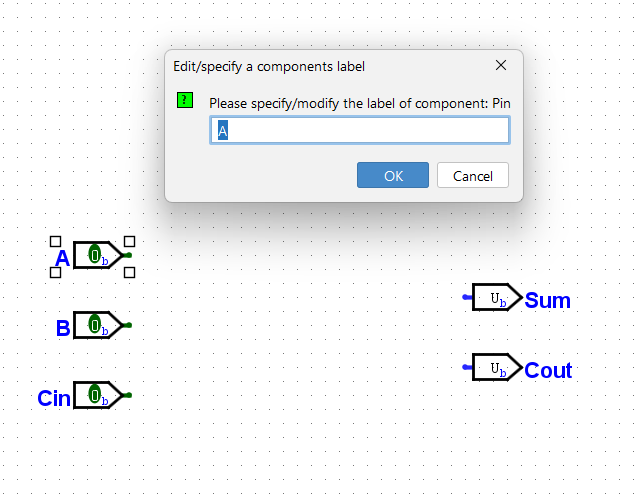


4.  Next, the gates should be added. The XOR and AND gate tool can be found on the tool bar. Click that tool and place three XOR gates on the circuit, two AND gates and one or gate. Click each gate and in its attributes/properties panel set the Number of Inputs to 2. Connect the gates to each other and to the ports through wires (you can create a wire by leftclicking on the canvas).
The circuit should look like: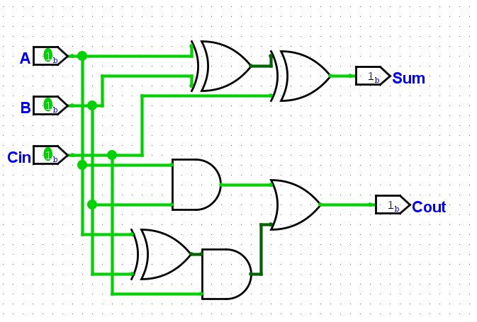

5. Make the main circuit active by double-clicking its name in the Explorer Panel. 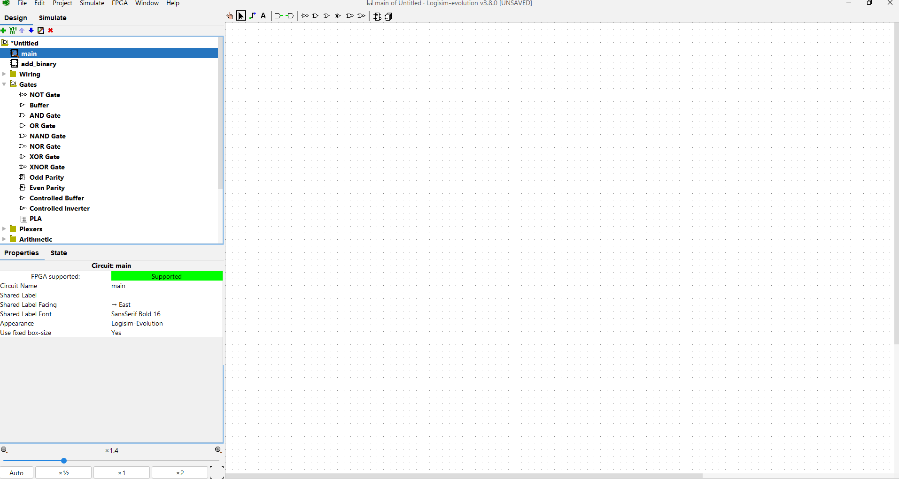


6. Click on the drawing canvas to drop that subcircuit. The circuit can later be moved by clicking it and dragging it to a new location.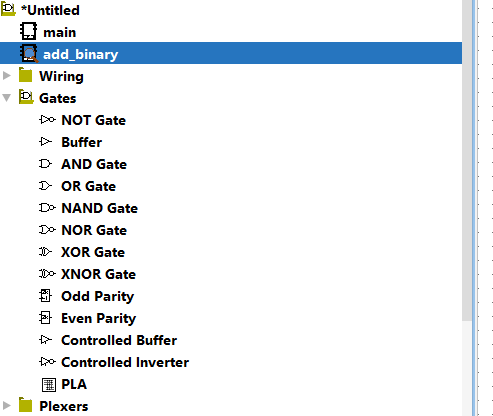

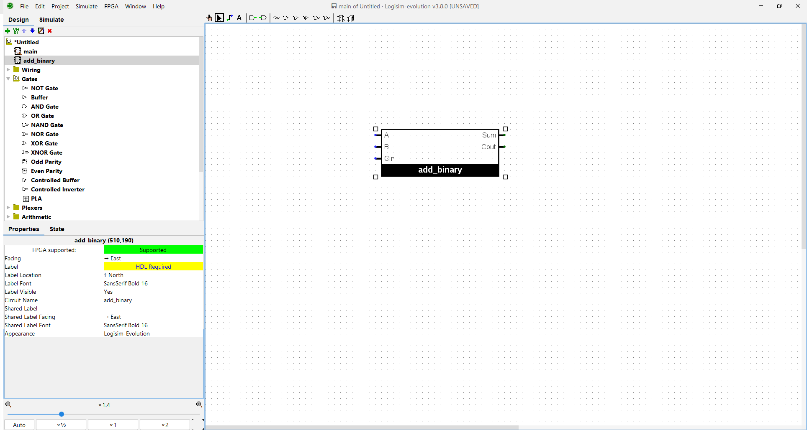


7. Add input and output pins to the main circuit same as those for the add_binary circuit 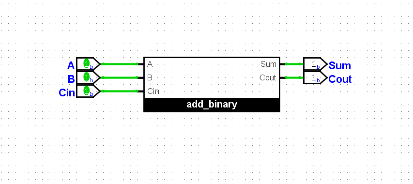

### Testing your design
One way to test this circuit is to use the poke tool and click various input combinations for both subcircuits. If the subcircuits are correct then the output will only go high when the correct combination is set on the inputs. 

However, as digital logic circuits become more complex it is important to automate the testing process so no input combinations are overlooked. Logisim-Evolution includes a Simulate -> Test Vector feature that is used for automating circuit testing.
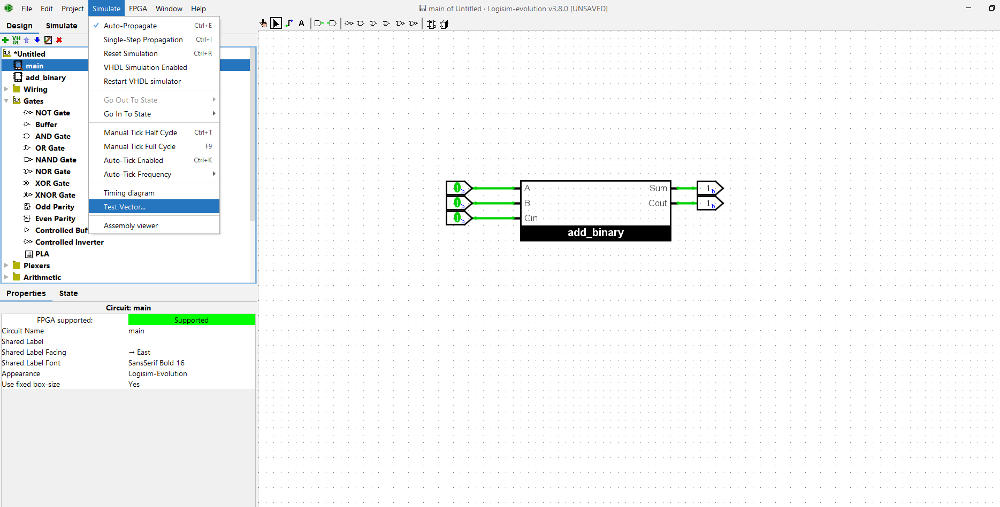
The first step in using automatic testing is to create a Test Vector file. This is a simple .txt file that can be created in any text processor, like Notepad. The format for a test vector is fairly simple.

- Every line is a single test of the circuit, except the first line.
- The first line defines the various inputs and outputs being tested.
- Any line that starts with a hash mark (#) is a comment and is ignored.
Following is the test vector file used to test the subcircuit. 
```
# Test vector for Lab 0
# Full Bit Adder
A B Cin Sum Cout
0 0 0 0 0
0 0 1 1 0
0 1 0 1 0
0 1 1 0 1
1 0 0 1 0
1 0 1 0 1
1 1 0 0 1
1 1 1 1 1
```
To start a test, click Simulate -> Test Vector. Click the Load Vector button at the bottom of the window and load the test vector file. The test will automatically start and Logisim- evolution will report the results, like in the below figure.
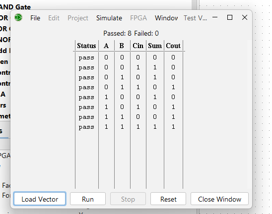

The test indicates all 8 lines passed and zero failed so it could be reasonably concluded that the circuits are functioning properly. If a failed test occurs, the circuit designer would then need to troubleshoot to determine what went wrong with the circuit.


Alternatively, logisim includes basic support for executing circuits from the command-line. This is intended both to help with scripted verification of circuit designs. After this circuit has been built, we can then execute Logisim from the command line, providing the filename of the project and the ```-tty``` option with the table parameter.
```
java -jar <logisim_program_path>.jar <circuit_file_path>.circ -tty table
```
#In this case, if both logisim and the circuit are placed in the same path, the command should be:
```
cd <path_to_files>
java -jar logisim-evolution-3.8.0-all.jar adder_circuit.circ -tty table
```
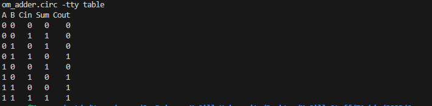
And to use testvectors in the commandline you can use this command: 

```
java -jar <logisim_program_path>.jar --no-splash --test-vector add_binary <test_vector_path>.txt  <adder_circuit_path>.circ

```
#In this case, if both all the files are placed in the same path, the command should be:
```
java -jar logisim-evolution-3.8.0-all.jar --no-splash --test-vector add_binary test_vectors.txt  adder_circuit.circ

```
This command can differ for different versions of logisim.
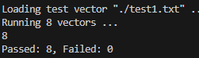


## 2. Building an 8-bit Full Adder Circuit
Logisim provides a component called splitter in the Wiring library in the explorer plane. It creates a correspondence between a multi-bit value and several seperate subsets of those bits. Despite the name, you may use the splitter as a "bundler" as well, joining multiple individual bits into a multi-bit value. You may want to use splitter in your 8-bit adder to help you manage the input and output values. The fan out represents the number of busses bundled or splitted from the larger input bus defined in Bit Width In. You can also assign how many bits are outputted/inputted in each if the outputs defined in Fan Out by adjusting Bit 0 -> Bit in the properties window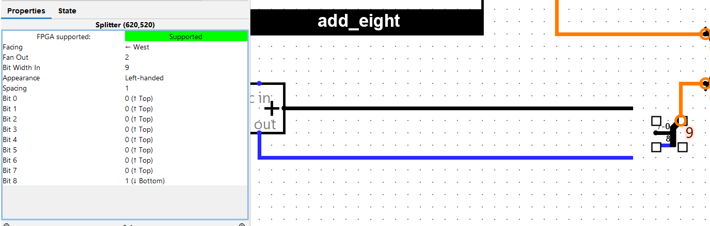

Now build an 8-bit adder using the 1-bit adder circuit. Test the circuit by using the poke tool or by creating a test vector file. Make sure to set the size of the input and output ports properly.
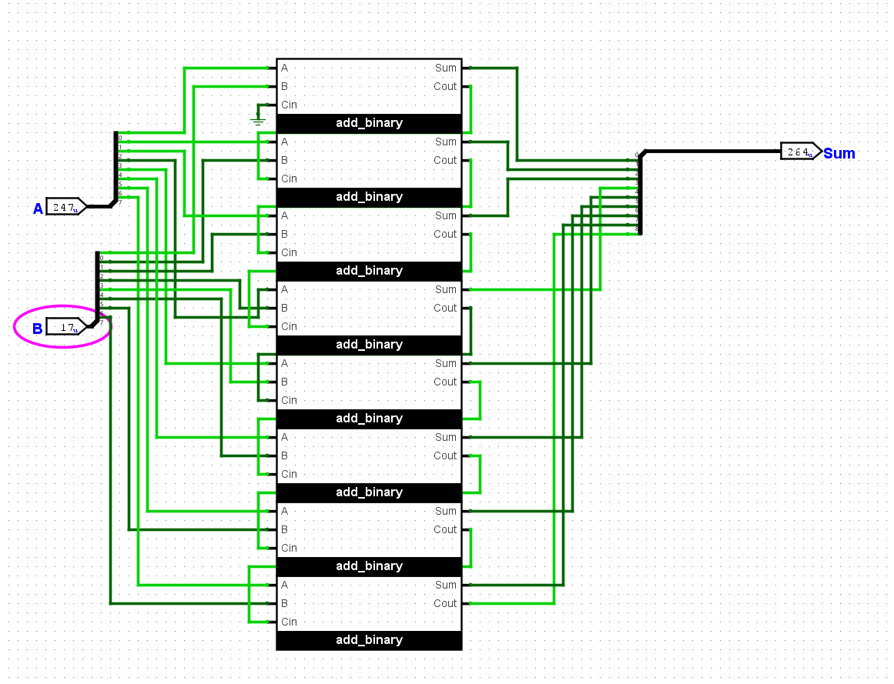
You can also change the radix of the input and output to decimal unsigned to help you with debugging the circuit.

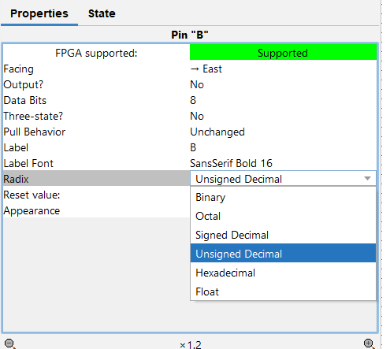


### Testing your design
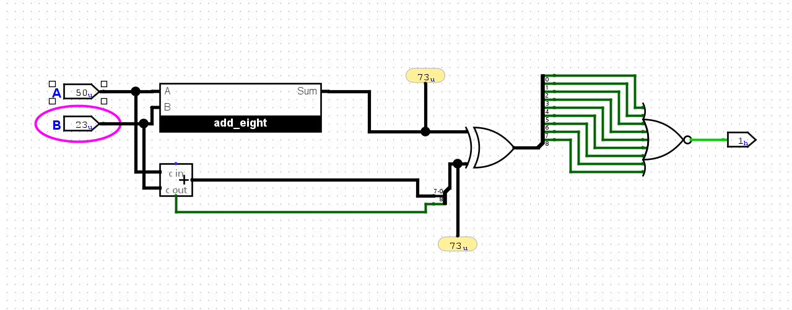

Probes provide real-time insight into how signals change and interact, aiding in the debugging and verification process. By connecting a Probe to a wire or a component's pin, you can visualize the logical values as they propagate through the circuit.

Create the above circuit to compare logisim's implementation of an adder, which can be found in the arithmetic folder in the explorer plane, to your designed adder. The output of this circuit should be 1 to show that the outputs of both adders are identical.

In this case, it is easier to use the command line to see that all the outputs for any input is 1:
``` 
java -jar <logisim_path>.jar <circuit_path>.circ -tty table
```


Now suppose we have two Logisim circuits logisim_adder.circ and custom_adder.circ that are supposed to do the same thing. Each file contains a circuit named add_eight (it's important that the circuit to test be named exactly the same).

We build our testing circuit into a different file test.circ. There, we load custom_adder.circ as a Logisim Library (Project ---> Load Library ---> Logisim Library) , and we insert its adder_eight as a subcircuit. We could execute this circuit directly to get the desired output for a perfect solution.

But we want to execute the circuit using logisim_adder.circ rather than custom_adder.circ as the loaded library. The naive approach would be to open Logisim and load that library instead; or you might simply remove the custom_adder.circ file and rename logisim_adder.circ to be named custom_adder.circ instead. But Logisim includes a handy ```-sub``` option that temporarily replace one file by another during that session — without making any changes on disk.
```
java -jar <logisim_path>.jar <testing_circuit_path>.circ -tty table -sub <circuit_you_want_to_test_path>.circ <original_circuit_present_in_testing_circuit_path>.circ
```

