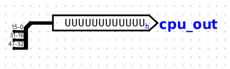
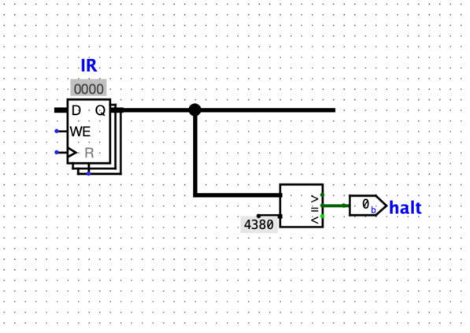
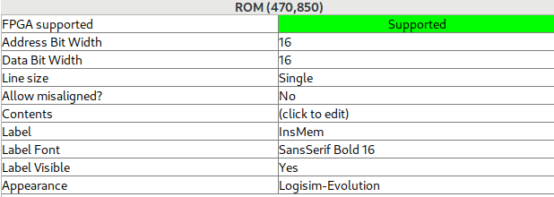

# Lab 1: CPU design

## Introduction

In this lab, you will learn to put into practice the concepts learned in class.
Your main goal will consist in implementing a 16-bit CPU supporting some of the most commonly found operations.
This lab is divided into 5 parts, carrying the following weights:

* ALU: 10%
* Register File: 10%
* Basic programmable CPU: 25%
* Memory support: 30%
* Branching support: 25%

### Starter circuit

To get you started, we provide you with a starter circuit that is mainly an empty shell.
:warning: Since marking will be done automatically, you are not allowed to:

* change the name of the sub-circuits given to you (e.g. ALU);
* add/remove input/output pins or change the name of the pins (unless explicitly stated);
* change the name of circuit file (`cpu.circ`).

### Marking

The work is to be done **individually** and any suspected cases of miss-conduct (i.e. cheating) will be reported to the faculty.

The score will solely depends on whether your implementation is able to pass the tests provided or not.
No mark will be given for "effort" as we only reward results.

The marking will be done by running some test vectors automatically on your circuit, or by using a dedicated testing circuits.
Your mark will be a function of the number of passed tests.

### Setup

For this lab, you must our own veruon of Logisim-evolution which has been tweaked to support loading a ROM memory.
You should download our version here: [../logisim-evolution-3.9.0dev-all.jar](../logisim-evolution-3.9.0dev-all.jar).
If you use any other version, there is a risk that the tests will not run properly and you might receive a score of zero.
Instruction about how to install Logisim can be found in lab 0, but again, make sure touse the version provided above.

### Logisim design tips

* Make use of text labels to keep track of what each signal is (look for the big `A` in the toolbar).

## Task 1. ALU

The Arithmetic and Logical Unit (ALU) forms the core of the CPU and it is where logical and arithmetic operations happen.
Your first task consists in designing an ALU that should support the 8 operations listed below:

| Function | Control Lines | Description                | Output C           |
|----------|---------------|----------------------------|--------------------|
| ADD      | 000           | signed integer addition    | C = A+B            |
| SUB      | 001           | signed integer subtraction | C = A-B            |
| AND      | 010           | bitwise AND                | C = A and B        |
| OR       | 011           | bitwise OR                 | C = A or B         |
| NOR      | 100           | bitwise NOR                | C = A nor B        |
| LSL      | 101           | logical shift left         | C = A << B[3-0]    |
| LSR      | 110           | logical shift right        | C = A >>> B[3-0]   |
| ASR      | 111           | arithmetic shift right     | C = A >> B[3-0]    |

The ALU has two data 16-bits inputs, `A` and `B` and one 16-bits data output `C`.
It also has three control lines that determine which operation is performed by the ALU, described in the table above.

In addition, the ALU also outputs four flags whose values depend on the result produced by the operations, as can be seen in the table below.

| Output flag | Description                                                                                                                                     |
|-------------|-------------------------------------------------------------------------------------------------------------------------------------------------|
| N: negative | 1 if C is negative                                                                                                                              |
| Z: zero     | 1 if C is zero                                                                                                                                  |
| C: carry    | 1 if a carry is generated when adding/subtracting (for all other functions, this is undefined, i.e. you can choose to output whatever you want) |
| V: overflow | 1 if overflow occurs when adding/subtracting (for all other functions, this is undefined, i.e. you can choose to output whatever you want) |

Note that in this lab, we assume that all arithmetic operations process numbers encoded in two's complement.

### Implementation

Your task consists of implementing the ALU in Logisim by filling up the ALU sub-circuit.
Note that for this task, you **are only allowed** to use components from the `Wiring`, `Gates`, `Plexers` and `Arithmetic`.
However, the `Subtractor` and `PLA` components **are not allowed**.

Your design should mainly consist of one component per function (except ADD and SUB which should share an adder), some logic to generate the flags, and a large multiplexer to produce the output result.

### Hints

* Use the `Comparator` and `Constant` components to generate the `N` and `Z` flags.
* Overflow happens when you sum two operands that have the same sign but the result has a different sign. 
* The `Splitter` component should be used to extract a set of bits from a wider signal. You should use it for controlling whether to add or subtract, and to extract the least significant bits of B that determines the amount of shifting.
* Bit 0 of a multi-bit signal is the least significant bit (i.e. right-most).

### Testing

You should test the behaviour of your ALU using the provided `alu_test.vec` file.
You can use the following command in a terminal (assuming you are running Linux or another Unix such as MacOSX) to test your ALU using a test vector which works well for combinational circuits:
`java -jar PATH_TO_LOGISIM_JAR_FILE --no-splash --test-vector ALU ./testfiles/alu/alu_test.vec cpu.circ`

## Task 2. Register File

Next, you are going to design a register file containing 8 registers of 16 bits each.
While a register file would be implemented using Memory Cells in a real CPU for efficiency reason, you should use actual registers with multiplexers.
This will make it easier to track the state of the CPU as we will see later.

**Registers:**
You should first start by instantiating 8 registers with 16 data bits.
Then connect the clock and reset pins to each register.
To make it easier, later on, to track what is going on in the CPU, label each register `R0`, `R1`, ..., `R7` and make sure to tick the box `Show in Register Tab` in the property box.
You can check the `State` tab to see the content of each register when simulating your circuit.

**Read:** 
Next, you should instantiate two multiplexers with 3 select bits (since we have 8 registers).
The output of the multiplexers should be connected to the output pins `A` and `B`, while the select signals should come from the input pins `Addr_A` and `Addr_B`.
Then, connect each register to the appropriate input of both multiplexers.
You want to ensure that when `010`, for instance, is present at the input pin `Addr_A`, the content of the `R2` appears on the output pin `A`, and similarly for `Addr_B` and `B`.

**Write:**
Finally, you are going to implement the write functionality.
When `WE` is equal to `1`, the `WE` signal of the appropriate register should be selected using `Addr_C` and the input `C` directed into the register.
For instance, if `WE` is `1`, `Addr_C` is `100`, and `C` is `10001000`, then the 4th register should contain `10001000` at the next clock cycle.
To achieve this, wire `C` to the input of each register, and use a decoder together with some boolean logic which depends on the output of the decoder and the `WE` signal to implement the functionality.

### Restrictions 

To implement the Register File in Logisim, you **are only allowed** to use components from the `Wiring`, `Gates`, `Plexers`, `Arithmetic` and `Memory`.
The `RAM` component **is not allowed**.

### Testing

Since the register file is a sequential circuit, we need to use a different testing methodology.
Instead of using a test vector, we have designed a tester circuit that provides different inputs to the register file at different clock cycle.
The sub-circuit is called `RegisterFileTester`.
While it will be useful to run this circuit in the GUI to test/debug your circuit, you can also run it from the command line and compare it with the gold reference output.
To do so, you can run the following command from the terminal:

`java -jar PATH_TO_LOGISIM_JAR_FILE --no-splash cpu.circ --tty table --toplevel-circuit RegisterFileTester`

This will output the A,B and clk signals.
The gold output is provided in the file `testfiles/regfile/rf_test_gold.out`.

## Task 3. Basic programmable CPU

We are now ready to implement a first version of our CPU using the building block we have just created.

Our processor will support a total of four type of instructions: ALU, Load, Store and Branch.
You will start by implementing the ALU instructions first and we will extend the processor to support the other instructions later.
The generic format for the ALU instructions is given in the table below:

|      | Opcode | ALU op. | I  | Dest. Reg. | Src. Reg1 | Src. Op. 2 |
|------|--------|---------|----|------------|-----------|------------|
| bits | 15-14  | 13-11   | 10 | 9-7        | 6-4       | 3-0        |

The opcode for each type of instructions is given below

| Instruction | Opcode |
|-------------|--------|
| ALU         | 00     |
| B           | 01     |
| LD          | 10     |
| ST          | 11     |

Again, only deal with the ALU instructions at this point.

#### Immediate value

Source operand 2 can either be a register or an immediate value, depending on the value of the I bit (0=register, 1=immediate value).
When the source operand 2 is a register, bits[2-0] should be used as the register number (which is fed into `Addr_B` of the register file). 

 

### Implementation

#### Datapath
You should start by designing the datapath as seen in the lecture, taking into account the five stages (Fetch,Decode,Execute,Memory,Writeback).
You should connect the register file to the ALU, via some registers, and then the ALU to the memory related registers, and finally these register to the final register to perform the writeback.

If the `I` bit is set, it means the second input for the ALU should not come from the Register File, but instead come for IR[3:0] and be signed extended.

Hint:

* use the `Splitter` and `Bit Extender` component.

#### Control

Once you have designed your datapath, you should design the control circuitry.
This is divided into two parts:

  * a finite state machine that mainly controls when the write_enable signals of the registers;
  * the PC,IR and instruction memory

You can implement them in any order.

##### Finite state machine

Your finite state machine should have five states corresponding to the five stages: Fetch, Decode, Execute, Memory and Writeback.
This means that each ALU instruction will take exactly five clock cycle to execute.

At each state, you should determine which of the registers should be written into. 
For instance, as seen in the lecture, in the Fetch state, the `IR` and `PC` register should be updated, while in the Decode state, the registers placed at the input of the ALU should be updated.

The control signals can be modelled with a register holding 3 bits.
At each cycle, add 1.
If reach fifth state, reset to first state.
The control signals for each state is in the following table.
These control signals corresponds to write_enable signals found in the full datapath as seen in the lecture.
             
| State      | ir_we | pc_we | ra_we | rb_we | rz_we | rd_we | rw_we | rf_we |
|------------|-------|-------|-------|-------|-------|-------|-------|-------|
| Fetch      | 1     | 1     | 0     | 0     | 0     | 0     | 0     | 0     |
| Decode     | 0     | 0     | 1     | 1     | 0     | 0     | 0     | 0     |
| Execute    | 0     | 0/1   | 0     | 0     | 1     | 1     | 0     | 0     |
| Memory     | 0     | 0     | 0     | 0     | 0     | 0     | 1     | 0     |
| Write-Back | 0     | 0     | 0     | 0     | 0     | 0     | 0     | 0/1   |

Note that while most signals simply depends on the state, the `rf_we` signal should be `0` in the writeback stage if the instruction does not write into the register file (e.g. store, branch).
Similarly, as we will see later, the `pc_we` signal should be one in the fetch stage, and sometimes in the execute stage in the presence of a taken branch (more on this later).

##### Instruction Memory, Instruction Register & Program Counter

You should connect together the instruction memory with the `PC` and `IR` as seen in the lecture.
The output of the PC should got back into itself via an adder to perform the increment.
Note that the ROM component has a word-size of 16 bits and is not byte-addressable. 
Hence the PC contains the address of a 16-bit value, and not the address of a byte.

Specific bits from the `IR` should be connected to the signals that controls the datapath.
For instance IR[13-11] should be connected to the ALU function while bits IR[9-7] should be connected to the address C of the register file.

### Testing

Based on the design, the instruction memory and the program counter are operated according to the control signals outputted from the control logic.

#### Tested signals

For testing the CPU, we will only check the values of the `PC`, `IR` and `RZ` register at different clock cycle.
You will need to add an output pin named `cpu_out` and ensure that this is the only output pin in your CPU top-level circuit.

In Logisim, the order of the output in the terminal is affected by the positions of the output pins, and different designs in Logisim might locate output pins in different positions. 
To prevent any issues, we will group the signals we are testing and organize them as follows:

|      | PC    | IR    | RZ   |
|------|-------|-------|------|
| bits | 47-32 | 31-16 | 15-0 |

You should use a splitter to connect the value of these three registers together and name the output signal `cpu_out` as seen below:

#### Simulation end

To ensure the simulation ends after executing all the instructions from the test case, a special instruction is used to indicate the end of the simulation.
The instruction `EQ -1, R0, R0`, which corresponds to `0x4380` indicates the end of the simulation.
The halt condition is implemented by comparing the output from the `IR` to `0x4380`.
The halt signal is `1` when the output from the IR is equal to `0x4380`.
An example implementation is shown in the following figure:

#### ROM label

To ensure that the automatic testing will work as expected, you must name the ROM which contains the instruction `InsMem`.
To do so, edit the `Label` property of the ROM and type `InsMem`.
You can also set the `LabelVisible` property to true to see the label above the ROM.

##### Loading and running the test

The steps for testing the circuit in the GUI are as follow:

1. Select the 64K X 16 ROM that stores instructions;

2. Right-click on it, choose "Load Image ..." and select the file ending in `.rom`.

3. Save your circuit into the `cpu.circ` file.

4. The test can now be run from the command line using:
` java -jar PATH_TO_LOGISIM_JAR_FILE --no-splash cpu.circ --tty table --toplevel-circuit CPU`

Note that the simulator will start simulating your circuit in the *exact same state* you saved it.
If you encounter any issues, make sure that your saved circuit is in a `reset` state.
This means, among other things, that your FSM should be in the `fetch` state and that all your registers should contain zero.
This can be achieved by ensuring that you have a `reset` signal connected to every register in your circuit, and that your press the `reset` pin in your circuit before saving it.

We provide three files for you to test your implementation:

* `testfiles/basic_cpu/aluinstrtest.asm` contains the human-readable instructions of the test
* `testfiles/basic_cpu/aluinstrtest.rom` contains the binary encoded instructions of the test (you need to load this file into the ROM)
* `testfiles/basic_cpu/aluinstrtest.out` contains the expected output

#### Marking

When marking your assignment, we will use the following command to run the test from the command line:

` java -jar PATH_TO_LOGISIM_JAR_FILE --no-splash cpu.circ --tty table --toplevel-circuit CPU -l TEST_FILE.rom InsMem`
where TEST_FILE.rom is one of the test files as listed below.
For this command to work, it is important that you have set the label for the ROM to `InsMem` as explained above,
and that you are using our version of Logisim as described under *Setup* at the top of this file.

### Debugging hint:

You should debug your circuit by simulating step by step by clicking on the `clock` pin and checking what happens at every clock cycle.
It might help to draw a time diagram on paper for the expected behaviour of some key signals (e.g. `IR`, selection sigals of multiplexers, enable signals)  and check with what you observe in simulation.

## Task 4. Data Memory and Memory Instructions

Next, we are going to add the ability to read and write into a data memory using our load and store instructions (encoding of the opcode can be found in the table above).
Add a RAM component to your circuit with the following values:

| Property                | Value                                |
|-------------------------|--------------------------------------|
| Address Bit Width       | 16                                   |
| Data Bit Width          | 16                                   |
| Enables                 | Use line enables                     |
| Ram type                | volatile                             |
| Use clear pin           | No                                   |
| Line Size               | Single                               |
| Allow misaligned?       | No                                   |
| Trigger                 | Rising Edge                          |
| Data bus implementation | Separate data bus for read and write |

Our data memory stores 16 bits values and uses an address width of 16 bits.
Contrary to the type of memories seen during class, this memory is not byte-addressable.
Instead, it is word addressable where a word is 16 bit.

Also note that this memory will immediately produce the data when changing the address, but will require one clock cycle when writing.
This means that the FSM that controls the processor can always move from the memory state to the writeback state without having to check that the memory operation has finished.

### Instruction encoding

#### Load instruction

The load instruction encoding is similar to that of the other ALU instructions as can be seen in the table below:

|      | Opcode | ALU op. | I  | Dest. Reg. | Src. Reg1 | Src. Op. 2 |
|------|--------|---------|----|------------|-----------|------------|
| bits | 15-14  | 13-11   | 10 | 9-7        | 6-4       | 3-0        |

As can be seen in the datapath from the slide and encoding above, `Src. Reg 1` and `Src. Op. 2` are both used as input to the ALU to compute an address.
For instance, if the ALU is set to `ADD`, `I=1` and `Src. Op. 2` is `0000`, then whatever the content of `Src. Reg1` is will be the address.

#### Store instruction

The store instruction's encoding differs a bit from the load instruction since the instruction does not write a result in a register:

|      | Opcode | ALU op. | I  | Data Reg. | Addr. Reg1  | Addr. Imm.   |
|------|--------|---------|----|-----------|-------------|--------------|
| bits | 15-14  | 13-11   | 10 | 9-7       | 6-4         | 3-0          |

Instead of a `Dest. Reg.` field, we find the `Data Reg` field which should be connected to `Addr_B` for the register file (a multiplexer will be necessary and the select signal will depend on the type of instruction).
The `Addr. Reg1` field will be connected as usual to `Addr_A` in the datapath, and similarly for `Addr. Imm` which is connected to the same location where the immediate value goes (mux in front of the 2nd input of the ALU).
The `I` bit of a store instruction should always be set to `1` since it is not possible to read more than two values from the register file (one for the data, one for the address).
This means that when using a store, we can only perform an operation on the address with the ALU using an immediate value on our CPU of the form:
address = `(Addr.Reg1) FUN (Addr.Imm.)` where `FUN` is any operation supported by the ALU.

### Implementation

As seen in the lecture, you should add the memory in the datapath in the place where the `processor-memory interface` goes.
Since the memory in logisim always produces the value read, there is no need for a `read` signal.
However, you will have to use a `write` control signal to determine when to write.
The `write` signal should be set to `1` when in the presence of store instruction and when the FSM is in the memory state.

In the case of a `Store` instruction, the encoding of the instruction has to be interpreted a little bit differently since we do not need a destination register.

### Testing

We will follow the same testing methodology as above to test your circuit:

* the CPU should have a single `cpu_out` signal;
* the ROM should be loaded; and
* your circuit should have been resetted.

We again provide three files for you to test your implementation:

* `testfiles/data_mem/linklisttestX.asm` contains the human-readable instructions of the test
* `testfiles/data_mem/linklisttestX.rom` contains the binary encoded instructions of the test (you need to load this file into the ROM)
* `testfiles/data_mem/linklisttestX.out` contains the expected output

The label `X` in the file name denotes the `Xth` test you should perform. In total two tests are provided to ensure the implementation is not hard-coded. Two test cases perform the same function but have different sets of values.

The test program consists of load/store instructions which first write a linked-list data structure in the data memory and then traverse the list.

## Task 5. Branching

Finally, we will implement a single conditional branch instruction which supports six different comparisons of its operands.

The instruction encoding for a branch is given in the following two tables.
Note that the three bits normally reserved for the destination register now contain the signed displacement of the current PC.

Instruction encoding:

|      | Opcode | Condition | I  | Displacement | Src. Reg1 | Src. Op. 2 |
|------|--------|-----------|----|--------------|-----------|------------|
| bits | 15-14  | 13-11     | 10 | 9-7          | 6-4       | 3-0        |

Condition encoding:

| Condition | Bit pattern | Description             | ALU flags         |
|-----------|-------------|-------------------------|-------------------|
| EQ        | 000         | equal                   | Z==1              |
| NE        | 001         | not equal               | Z==0              |
| LT        | 010         | signed less than        | N!=V              |
| LE        | 011         | signed less or equal    | (Z==1) or (N!=V)  |
| GT        | 100         | signed greater than     | (Z==0) and (N==V) |
| GE        | 101         | signed greater or equal | N==V              |

The semantic of the branch instruction is to update the current PC by adding the displacement to it, if the condition described by the bit pattern is true.
Note that the `PC` will be ahead by 1 instruction since during the fetch stage, the `PC` has already been incremented.
This is a totally normal behaviour and you should not try to correct this in any ways.

For instance, the instruction:

 * `01 000 0 011 001 0100`, which corresponds to Opcode=01=B, Condition=000=EQ, I=0, Displacement=011, SrcReg1=001, SrcOp2=0100 will increment the current PC by 3 if the content of register 1 and 2 are equal.
 * `01 101 1 100 010 0000`, which corresponds to Opcode=01=B, Condition=101=GE, I=1, Displacement=100, SrcReg1=010, SrcOp2=0000 will increment the current PC by -4 if the content of register 1 is greater or equal to 0.
 * `01 000 0 010 000 0000` will always increment the PC by 2 since we are comparing whether register 0 is equal to itself.

### Implementation

Implementing such a conditional branch instruction requires a few changes to the design.

First, we need to detect if we have a branch instruction, and if so configure the ALU to perform a subtraction.
This is achieved by using IR[15-14] to detect whether we are in the presence of a branch instruction or not, and then by using a multiplexer to control the function of the ALU (either the function comes from IR[13-11] or it is set to `001` in case of a branch).

Then, you will have to modify the FSM to add an edge from the execute stage to the fetch stage if a branch is *taken* (branch instruction present and condition is true).

You will also have to insert a multiplexer in front of the `PC` adder to either increment  (normal behaviour when no branching occur) or to increment by the signed extended value corresponding to the bits  9-7 of the IR (the displacement).
Finally, you will have to modify the logic of the `pc_we` which is defined with the following equation:`pc_we = fetch or (execute and branch_taken)`.
In plain english, the pc is modified if we are in the fetch stage, or if we are in the execute stage and a branch is taken.

### Testing

We will follow the same testing methodology as above to test your circuit:

* the CPU should have a single `cpu_out` signal;
* the ROM should be loaded; and
* your circuit should have been resetted.

We again provide three files for you to test your implementation:

* `testfiles/branching/multiplicationX.asm` contains the human-readable instructions of the test
* `testfiles/data_mem/multiplicationX.rom` contains the binary encoded instructions of the test (you need to load this file into the ROM)
* `testfiles/data_mem/multiplicationX.out` contains the expected output

The label `X` in the file name denotes the `Xth` test you should perform. In total four tests are provided to ensure the implementation is not hard-coded. Four test cases perform the same function but have different sets of values.

The test program consists of ALU/branching instructions which performs the multiplication function.

## Submission

The submission will be done on myCourses.
**You must submit a single file, named `cpu.circ`.**
Your circuit should be in a "clean" state:

* all the registers should have been resetted;
* the finite state machine is in the fetch state;
* the instruction memory (ROM) and data memory (RAM) contain only zeroes.

In addition, you must ensure that the ROM which contains the instruction is labelled `InsMem` as explained earlier.

### Marking

Using our own version of the simulator, the following command will be run to test and mark your circuit:

| Task                                            | Command                                                                                                                                        | Gold output                               |
|-------------------------------------------------|------------------------------------------------------------------------------------------------------------------------------------------------|-------------------------------------------|  
| **Task 1.** ALU                                 | `java -jar PATH_TO_LOGISIM_JAR_FILE --no-splash --test-vector ALU ./testfiles/alu/alu_test.vec cpu.circ`                                       | Passed: 28, Failed: 0                     |
| **Task 2.** Register File                       | `java -jar PATH_TO_LOGISIM_JAR_FILE --no-splash cpu.circ --tty table --toplevel-circuit RegisterFileTester`                                    | `testfiles/regfile/rf_test_gold.out`      |
| **Task 3.** Basic programmable CPU              | `java -jar PATH_TO_LOGISIM_JAR_FILE --no-splash cpu.circ --tty table --toplevel-circuit CPU -l testfiles/basic_cpu/aluinstrtest.rom InsMem`    | `testfiles/basic_cpu/aluinstrtest.out`    |
| **Task 4.** Data memory and memory instructions | `java -jar PATH_TO_LOGISIM_JAR_FILE --no-splash cpu.circ --tty table --toplevel-circuit CPU -l testfiles/data_mem/linklisttest1.rom InsMem`    | `testfiles/data_mem/linklisttest1.out`    |
|                                                 | `java -jar PATH_TO_LOGISIM_JAR_FILE --no-splash cpu.circ --tty table --toplevel-circuit CPU -l testfiles/data_mem/linklisttest2.rom InsMem`    | `testfiles/data_mem/linklisttest2.out`    |
| **Task 5.** Branching                           | `java -jar PATH_TO_LOGISIM_JAR_FILE --no-splash cpu.circ --tty table --toplevel-circuit CPU -l testfiles/branching/multiplication1.rom InsMem` | `testfiles/branching/multiplication1.out` |
|                                                 | `java -jar PATH_TO_LOGISIM_JAR_FILE --no-splash cpu.circ --tty table --toplevel-circuit CPU -l testfiles/branching/multiplication2.rom InsMem` | `testfiles/branching/multiplication2.out` |
|                                                 | `java -jar PATH_TO_LOGISIM_JAR_FILE --no-splash cpu.circ --tty table --toplevel-circuit CPU -l testfiles/branching/multiplication3.rom InsMem` | `testfiles/branching/multiplication3.out` |
|                                                 | `java -jar PATH_TO_LOGISIM_JAR_FILE --no-splash cpu.circ --tty table --toplevel-circuit CPU -l testfiles/branching/multiplication4.rom InsMem` | `testfiles/branching/multiplication4.out` |

To obtain the points for a given task, your output must be identical to the gold output for **all the tests associated with the task**.
If you have any mistake on any of the tests, you will score 0 for the corresponding task (there will be no partial points given).
The tests above are the only ones we will use to mark your assignment.

:warning: You are not allowed to hard-code the output of your circuit for a given task.
You must implement the CPU as explained in the description (and in the lecture slides).
If you hard-code the output (e.g. by building a sequential circuit that outputs the expected output signals at each clock cycle), this will be considered a form of cheating and you will receive a mark of zero.
