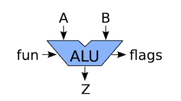
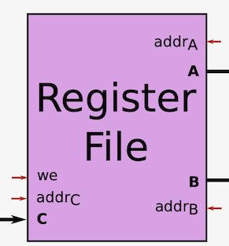

# Tutorial 2
## Tutorial questions

Here are questions that will be solved during the tutorial.

### Question 1

For a 256x1 RAM:

*  How many bits are needed for the memory address?
*  What should the dimensions of the cell array be?

### Question 2

Write the following numbers as 8-bit binary numbers in sign-and-magnitude / 1's complement / 2's complement representation: 0, 25, 137, -25, -127

### Question 3

How to negate a number in 2's complement form?

### Question 4

An ALU is a component that deals with arithmetic and boolean operations.
The idea is that this component receives the inputs values (A and B)
and some signal indicating which arithmetic or logical operation should be performed (fun),
and it would produce the result (Z) and some information about the result (flags).
Design a 4-bit ALU with the following functionality:

 fun | Name | Description | Z (Output)
-----|------|-------------|--------
  00 | ADD  | Addition | A + B
  01 | AND  | Bitwise And | A and B
  10 | LSR  | Logical right shift | A >>> B[1-0]
  11 | ASR  | Arithmetic right shift | A >> B[1-0]

 flag bit | Name | Description
----------|------|-------------
 3        | N    | If the result is negative
 2        | Z    | If the result is zero
 1        | C    | If the addition had a carry-out
 0        | V    | If the addition overflowed

{width=50%}

(ALU figure from the lecture slides)

### Question 5

A register file is a component that deals with holding temporary values.
The idea is that we define a fixed number of registers, each has an address.
We can read their values from A or B using addrA or addrB,
and we can change their values by placing the new value at C, the corresponding address at addrC,
and enabling the write-enabled (we) port.
Design a register file with four 4-bit registers.

{width=50%}

(Register file figure from the lecture slides)
