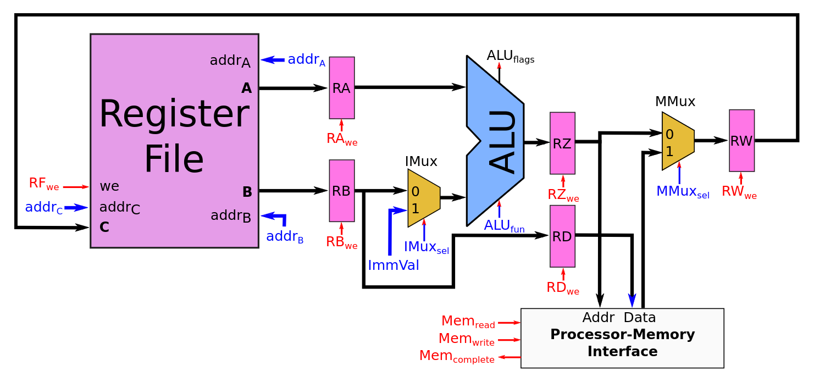
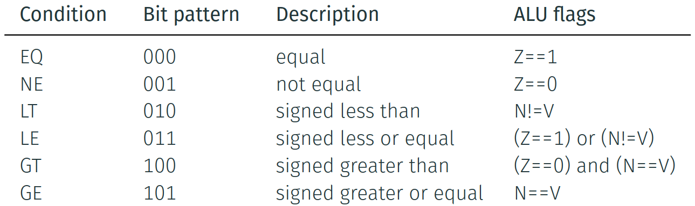
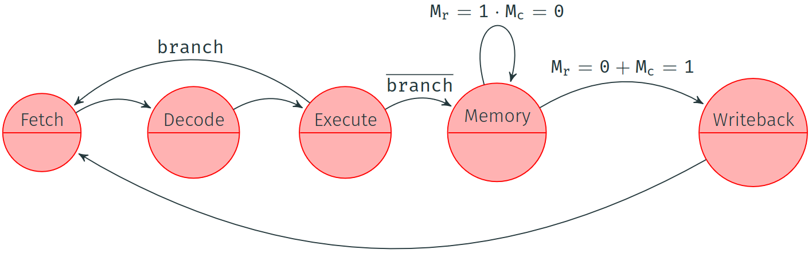

# Tutorial 3

## Question 1

Consider the processor design below (same image as on slide 51).

{width=50%}

What are the control signals at the decode, execute, memory and writeback stages for instruction `Store R2, R5+4`?

> **Hint:** Slides 52 and 53 show the control signals for instructions `Add R3, R4, R5` and `Load R2, R5`, respectively. If you're not sure where to start, consider those control signals and explore how they can be adapted to form the control signals for `Store R2, R5+4`.

## Question 2

Conditional branches are implemented by instructing the ALU to perform a computation.
The ALU flags that result from the computation are then used to decide whether the branch is taken or not.

The table below, copied from slide 66, shows which ALU flags are inspected for a variety of conditions.
In each case, the ALU is instructed to perform a subtraction.

{width=50%}

Let `ULT`, `ULE`, `UGT` and `UGE` be the unsigned equivalents of the `LT`, `LE`, `GT` and `GE` conditions.
`UGE` can be implemented by checking if the ALU's carry flag is set to zero.
Implement the `ULT`, `ULE` and `UGT` conditions.
What ALU flags do they inspect?

> **Why inspect the carry flag?**
> If `a >= b`, then `a - b` is in `[0, a]`, resulting in a carry flag of zero.
> Conversely, if the carry flag were one, `a - b` would require an additional (sign) bit to represent, indicating a negative result; hence, `a >= b` only if the carry flag is set.

## Question 3

The datapath from the lecture slides is based on a Harvard architecture, meaning instructions and data are stored in separate memories.
Suppose we instead wanted to build a processor based on a Von Neumann architecture, where instructions and data share the same memory.

How would the change in architecture affect the processor's datapath and control?
Add arrows to the processor design where applicable and build an updated version of the finite state machine included below (copied from slide 61).

{width=50%}